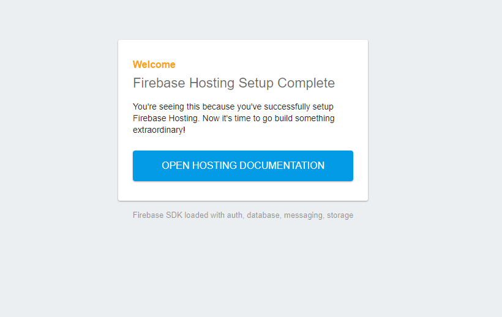
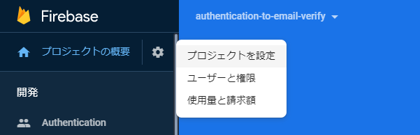
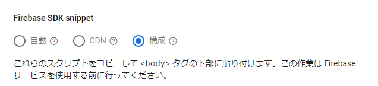
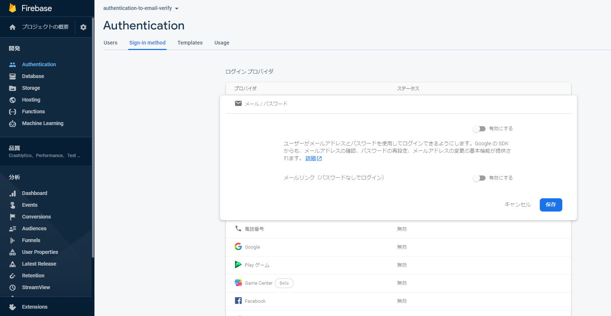

ここでは、Firebaseを使った、新規アカウント登録からメール確認までの認証機能をサンプルコードとともに順番に説明していきます。

## 準備
今回は「Firebaseでの新規プロジェクト作成」および「firebase toolの導入」が済んでいるものとして話を進めていきます。

もし、上記の準備ができていない方は、公式の[Firebase プロジェクトを作成する](https://firebase.google.com/docs/web/setup?authuser=0#create-project)からプロジェクトの作成、および以下のコマンドでfirebase toolをインストールしておいてください

```bash:title=bash
npm install -g firebase-tools
```

## プロジェクトの初期化
まずはFirebaseのプロジェクトを初期化するところから始めます。

導入しているfirebase toolから以下のコマンドでGoogleへのログインをします。

```bash:title=bash
firebase login
```

そして、次のコマンドでfirebaseのプロジェクトを初期化します。

```bash:title=bash
firebase init
```

上記のコマンドを実行後いろいろと質問されます。今回はそれらについて以下のように設定していきます。

```bash:title=bash
 Which Firebase CLI features do you want to set up for this folder? Press Space to select features, then Enter to confirm your choices.
 => Hosting: Configure and deploy Firebase Hosting sites （今回はHostingのみで問題ありません）

 Please select an option
 => Use an existing project
 => 自分のプロジェクトを選択

 What do you want to use as your public directory?
 => そのままEnter or publicと入力 （今回はデフォルトのままで進めたいので）

 Configure as a single-page app (rewrite all urls to /index.html)?
 => y （特に遷移することはないので）
```

初期化が終了するとpublicフォルダが作成され、中に以下のコードのindex.htmlファイルが生成されていると思います。

```html:title=index.html
<!DOCTYPE html>
<html>
  <head>
    <meta charset="utf-8">
    <meta name="viewport" content="width=device-width, initial-scale=1">
    <title>Welcome to Firebase Hosting</title>

    <!-- update the version number as needed -->
    <script defer src="/__/firebase/7.15.5/firebase-app.js"></script>
    <!-- include only the Firebase features as you need -->
    <script defer src="/__/firebase/7.15.5/firebase-auth.js"></script>
    <script defer src="/__/firebase/7.15.5/firebase-database.js"></script>
    <script defer src="/__/firebase/7.15.5/firebase-messaging.js"></script>
    <script defer src="/__/firebase/7.15.5/firebase-storage.js"></script>
    <!-- initialize the SDK after all desired features are loaded -->
    <script defer src="/__/firebase/init.js"></script>

    <style media="screen">
      body { background: #ECEFF1; color: rgba(0,0,0,0.87); font-family: Roboto, Helvetica, Arial, sans-serif; margin: 0; padding: 0; }
      #message { background: white; max-width: 360px; margin: 100px auto 16px; padding: 32px 24px; border-radius: 3px; }
      #message h2 { color: #ffa100; font-weight: bold; font-size: 16px; margin: 0 0 8px; }
      #message h1 { font-size: 22px; font-weight: 300; color: rgba(0,0,0,0.6); margin: 0 0 16px;}
      #message p { line-height: 140%; margin: 16px 0 24px; font-size: 14px; }
      #message a { display: block; text-align: center; background: #039be5; text-transform: uppercase; text-decoration: none; color: white; padding: 16px; border-radius: 4px; }
      #message, #message a { box-shadow: 0 1px 3px rgba(0,0,0,0.12), 0 1px 2px rgba(0,0,0,0.24); }
      #load { color: rgba(0,0,0,0.4); text-align: center; font-size: 13px; }
      @media (max-width: 600px) {
        body, #message { margin-top: 0; background: white; box-shadow: none; }
        body { border-top: 16px solid #ffa100; }
      }
    </style>
  </head>
  <body>
    <div id="message">
      <h2>Welcome</h2>
      <h1>Firebase Hosting Setup Complete</h1>
      <p>You're seeing this because you've successfully setup Firebase Hosting. Now it's time to go build something extraordinary!</p>
      <a target="_blank" href="https://firebase.google.com/docs/hosting/">Open Hosting Documentation</a>
    </div>
    <p id="load">Firebase SDK Loading&hellip;</p>

    <script>
      document.addEventListener('DOMContentLoaded', function() {
        // // 🔥🔥🔥🔥🔥🔥🔥🔥🔥🔥🔥🔥🔥🔥🔥🔥🔥🔥🔥🔥🔥🔥🔥🔥🔥🔥🔥🔥🔥🔥🔥
        // // The Firebase SDK is initialized and available here!
        //
        // firebase.auth().onAuthStateChanged(user => { });
        // firebase.database().ref('/path/to/ref').on('value', snapshot => { });
        // firebase.messaging().requestPermission().then(() => { });
        // firebase.storage().ref('/path/to/ref').getDownloadURL().then(() => { });
        //
        // // 🔥🔥🔥🔥🔥🔥🔥🔥🔥🔥🔥🔥🔥🔥🔥🔥🔥🔥🔥🔥🔥🔥🔥🔥🔥🔥🔥🔥🔥🔥🔥

        try {
          let app = firebase.app();
          let features = ['auth', 'database', 'messaging', 'storage'].filter(feature => typeof app[feature] === 'function');
          document.getElementById('load').innerHTML = `Firebase SDK loaded with ${features.join(', ')}`;
        } catch (e) {
          console.error(e);
          document.getElementById('load').innerHTML = 'Error loading the Firebase SDK, check the console.';
        }
      });
    </script>
  </body>
</html>
```

これでfirebaseプロジェクトの初期化は完了です。

<div class="ads"></div>

## Firebase SDKの初期化
FirebaseのSDKは初期化しないと使えません。ひとまず、先ほど自動的に作成されたコードをデプロイして初期化されていることを確認してみます。

### ひとまずデプロイ
以下のコマンドでデプロイしましょう。

```bash:title=bash
firebase deploy
```

デプロイが成功すると、以下の形式のURLに表示されるようになるのでアクセスして確認してください。

- projectID.web.app
- projectID.firebaseapp.com

以下の画像のように

> Firebase SDK loaded with auth, database, messaging, storage

といったメッセージが表示されて入れば初期化ができていることになります。



### どこで初期化されているのか?
Firebase SDKはプロジェクトに設定されたConfigと`firebase.initializeApp`という関数を使って初期化します。

```js:title=JavaScript
var firebaseConfig = {
  // ...
};

// Initialize Firebase
firebase.initializeApp(firebaseConfig);
```

しかし、今回のデフォルトで出力されたコードでは、上記の記述をしていません。

いったいどこで初期化してくれているのかというと、`head`タグにある以下のコードです。

```html:title=index.html
<script defer src="/__/firebase/init.js"></script>
```

Firebase Hosting を使用する場合は、SDKを予約済みの URL から動的に読み込むようにできます。これでFirebase側が自動的に初期化のコードを生成してくれます。詳しくは公式の[予約済みの Hosting URL から SDK を追加する](https://firebase.google.com/docs/hosting/reserved-urls?authuser=0)を見てください。

実際に自動的に読み込まれるコードは以下のようなものです。（キーも自動で設定されています）

```js:title=JavaScript
if (typeof firebase === 'undefined') throw new Error('hosting/init-error: Firebase SDK not detected. You must include it before /__/firebase/init.js');
firebase.initializeApp({
  "apiKey": "",
  "authDomain": "",
  "databaseURL": "",
  "messagingSenderId": "",
  "projectId": "",
  "storageBucket": ""
});
```

### 自分で初期化する
Firebase Hostingを利用しな場合は自分で初期化を行わなければなりません。以下の手順でConfigを取得し`firebase.initializeApp`を使って行いましょう。

まずはサイドバーからプロジェクトの設定画面へ行きます。



全般タブ（初期段階で選択）の下側、**マイアプリ**＞**Firebase SDK snippet**から構成を選択して表示されるConfigを取得します。



### 最終的な初期化のコード

自動的に作成されたコードは今回必要ないものを含んでいるので、いらないものを削除しました。今後は以下の`index.html`と`index.js`を編集しながら進めていきます。

```html:title=index.html
<!DOCTYPE html>
<html lang="ja">

<head>
  <meta charset="UTF-8">
  <meta name="viewport" content="width=device-width, initial-scale=1.0">
  <title>Firebase Authentication to Email verify</title>
</head>

<body>
  <p id="load">Firebase SDK Loading&hellip;</p>
  <!-- script -->
  <script src="/__/firebase/7.15.5/firebase-app.js"></script>
  <script src="/__/firebase/7.15.5/firebase-analytics.js"></script>
  <script src="/__/firebase/7.15.5/firebase-auth.js"></script>
  <script src="/__/firebase/init.js"></script>
  <script src="./index.js"></script>
</body>

</html>
```

```js:title=index.js
// firebase.initializeAppができているかどうかの確認
document.addEventListener('DOMContentLoaded', function () {
  try {
    let app = firebase.app();
    let features = ['auth', 'database', 'messaging', 'storage'].filter(feature => typeof app[feature] === 'function');
    document.getElementById('load').innerHTML = `Firebase SDK loaded with ${features.join(', ')}`;
  } catch (e) {
    console.error(e);
    document.getElementById('load').innerHTML = 'Error loading the Firebase SDK, check the console.';
  }
});
```

## アカウント登録とログイン

メールパスワード認証を利用するためには、Firebaseコンソールで利用するための設定をする必要があります。

コンソールから**Authentication**＞**Sign-in method**タブからメール/パスワードを有効化しておきましょう。



### フォームと処理の追加
アカウント登録とログインのためのフォームと処理を追加していきます。

メールとパスワードのフォームとアカウント登録とログインのボタンというシンプルな構成で進めます。

```html:title=index.html
<input type="email" id="email" placeholder="email">
<input type="password" id="password" placeholder="password">
<input type="button" onclick="signup()" value="アカウント作成">
<input type="button" onclick="login()" value="ログイン">
```

```js:title=index.js
function signup() {
  let email = document.getElementById('email').value
  let password = document.getElementById('password').value
  firebase.auth().createUserWithEmailAndPassword(email, password)
    .then(() => {
      console.log('ユーザー作成完了')
      alert('ユーザー作成完了')
    })
    .catch((error) => {
      console.log('ユーザー作成失敗', error);
      alert('ユーザー作成失敗')
    });
}

function login() {
  let email = document.getElementById('email').value
  let password = document.getElementById('password').value
  firebase.auth().signInWithEmailAndPassword(email, password)
    .then(() => {
      console.log('ログイン完了')
      alert('ログイン完了')
    })
    .catch((error) => {
      console.log('ログイン失敗', error);
      alert('ログイン失敗')
    });
}
```

アカウント登録には`createUserWithEmailAndPassword`を用います。引数にはメールとパスワードが必要です。

ログインには`signInWithEmailAndPassword`を用います。こちらも引数にメールとパスワードが必要です。

公式のドキュメントやリファレンスは以下の通りです。

[createUserWithEmailAndPassword](https://firebase.google.com/docs/reference/js/firebase.auth.Auth?authuser=0#createuserwithemailandpassword)

[signInWithEmailAndPassword](https://firebase.google.com/docs/reference/js/firebase.auth.Auth?authuser=0#signinwithemailandpassword)

[JavaScript でパスワード ベースのアカウントを使用して Firebase 認証を行う](https://firebase.google.com/docs/auth/web/password-auth?authuser=0)

### 全体のコードの確認

```html:title=index.html
<!DOCTYPE html>
<html lang="ja">

<head>
  <meta charset="UTF-8">
  <meta name="viewport" content="width=device-width, initial-scale=1.0">
  <title>Firebase Authentication to Email verify</title>
</head>

<body>
  <p id="load">Firebase SDK Loading&hellip;</p>
  <input type="email" id="email" placeholder="email">
  <input type="password" id="password" placeholder="password">
  <input type="button" onclick="signup()" value="アカウント作成">
  <input type="button" onclick="login()" value="ログイン">
  <!-- script -->
  <script src="/__/firebase/7.15.5/firebase-app.js"></script>
  <script src="/__/firebase/7.15.5/firebase-analytics.js"></script>
  <script src="/__/firebase/7.15.5/firebase-auth.js"></script>
  <script src="/__/firebase/init.js"></script>
  <script src="./index.js"></script>
</body>

</html>
```

```js:title=index.js
// firebase.initializeAppができているかどうかの確認
document.addEventListener('DOMContentLoaded', function () {
  try {
    let app = firebase.app();
    let features = ['auth', 'database', 'messaging', 'storage'].filter(feature => typeof app[feature] === 'function');
    document.getElementById('load').innerHTML = `Firebase SDK loaded with ${features.join(', ')}`;
  } catch (e) {
    console.error(e);
    document.getElementById('load').innerHTML = 'Error loading the Firebase SDK, check the console.';
  }
});


function signup() {
  let email = document.getElementById('email').value
  let password = document.getElementById('password').value
  firebase.auth().createUserWithEmailAndPassword(email, password)
    .then(() => {
      console.log('ユーザー作成完了')
      alert('ユーザー作成完了')
    })
    .catch((error) => {
      console.log('ユーザー作成失敗', error);
      alert('ユーザー作成失敗')
    });
}

function login() {
  let email = document.getElementById('email').value
  let password = document.getElementById('password').value
  firebase.auth().signInWithEmailAndPassword(email, password)
    .then(() => {
      console.log('ログイン完了')
      alert('ログイン完了')
    })
    .catch((error) => {
      console.log('ログイン失敗', error);
      alert('ログイン失敗')
    });
}
```

## ログイン状態の確認とログアウト
Firebaseの認証は、どのくらい状態を維持するかという永続性を以下のように設定できます。

|    値   |                                                                 説明                                                                |
|:-------:|:-----------------------------------------------------------------------------------------------------------------------------------:|
| local   | ブラウザ ウィンドウを閉じたり React Native でアクティビティが破棄されたりした場合でも、状態が維持される。明示的なログアウトが必要。 |
| session | 現在のセッションまたはタブでのみ状態が維持される。タブやウィンドウを閉じるとクリアされる。                                          |
| none    | 状態はメモリにのみ保存され。ウィンドウまたはアクティビティが更新されるとクリアされる。                                              |

[認証状態の永続性](https://firebase.google.com/docs/auth/web/auth-state-persistence?hl=ja)

デフォルトでは`local`に設定されているので、ログアウトの処理を用意しておく必要があります。

以下では、ログイン状態の確認とログアウトの処理を実装していきます。

<div class="ads"></div>

### 認証状態の表示と処理の追加
まずは、認証状態の確認の追加から。コードは以下の通りです。

```html:title=index.html
<p id="auth">認証確認中...</p>
```

```js:title=index.js
let unsubscribe = firebase.auth().onAuthStateChanged(user => {
  if (user) {
    console.log('ログイン済み')
    document.getElementById('auth').innerText = 'ログイン済み'
  } else {
    console.log('未ログイン')
    document.getElementById('auth').innerText = '未ログイン'
  }
})
```
認証状態は`onAuthStateChanged`を用いて監視することができます。これは、一度実行しておくと解除するまで常に監視をし、認証状態が変わるごとに処理てくれます。

解除には`onAuthStateChanged`実行時に返却される`unsubscribe()`を実行する必要があります。（今回は行いません。）

公式のドキュメントやリファレンスは以下の通りです。

[onAuthStateChanged](https://firebase.google.com/docs/reference/js/firebase.auth.Auth?authuser=0#onauthstatechanged)

### ログアウトのボタンと処理の追加

次にログアウトの追加です。コードは以下の通りです。

```html:title=index.html
<input type="button" onclick="logout()" value="ログアウト">
```

```js:title=index.js
function logout() {
  firebase.auth().signOut().then(() => {
    console.log('ログアウトしました')
    alert('ログアウトしました')
    document.getElementById('emailVerify').innerHTML = 'ログイン後に確認します'
  }).catch((error) => {
    console.log('ログアウト失敗', error);
    alert('ログアウト失敗')
  })
}
```

ログアウトは`signOut`を用います。特に引数があるわけでもないので非常に簡単です。

公式のドキュメントやリファレンスは以下の通りです。

[signOut](https://firebase.google.com/docs/reference/js/firebase.auth.Auth?authuser=0#signout)

### 全体のコードの確認
ここまでで、アカウント作成、ログイン、認証状態の確認、ログアウトまでという基本的な認証機能を実装出来ました。

以下が全体のコードです。

```html:title=index.html
<!DOCTYPE html>
<html lang="ja">

<head>
  <meta charset="UTF-8">
  <meta name="viewport" content="width=device-width, initial-scale=1.0">
  <title>Firebase Authentication to Email verify</title>
</head>

<body>
  <p id="load">Firebase SDK Loading&hellip;</p>
  <p id="auth">認証確認中...</p>
  <input type="email" id="email" placeholder="email">
  <input type="password" id="password" placeholder="password">
  <input type="button" onclick="signup()" value="アカウント作成">
  <input type="button" onclick="login()" value="ログイン">
  <input type="button" onclick="logout()" value="ログアウト">
  <!-- script -->
  <script src="/__/firebase/7.15.5/firebase-app.js"></script>
  <script src="/__/firebase/7.15.5/firebase-analytics.js"></script>
  <script src="/__/firebase/7.15.5/firebase-auth.js"></script>
  <script src="/__/firebase/init.js"></script>
  <script src="./index.js"></script>
</body>

</html>
```

```js:title=index.js
// firebase.initializeAppができているかどうかの確認
document.addEventListener('DOMContentLoaded', function () {
  try {
    let app = firebase.app();
    let features = ['auth', 'database', 'messaging', 'storage'].filter(feature => typeof app[feature] === 'function');
    document.getElementById('load').innerHTML = `Firebase SDK loaded with ${features.join(', ')}`;
  } catch (e) {
    console.error(e);
    document.getElementById('load').innerHTML = 'Error loading the Firebase SDK, check the console.';
  }
});

let unsubscribe = firebase.auth().onAuthStateChanged(user => {
  if (user) {
    console.log('ログイン済み')
    document.getElementById('auth').innerText = 'ログイン済み'
  } else {
    console.log('未ログイン')
    document.getElementById('auth').innerText = '未ログイン'
  }
})

function signup() {
  let email = document.getElementById('email').value
  let password = document.getElementById('password').value
  firebase.auth().createUserWithEmailAndPassword(email, password)
    .then(() => {
      console.log('ユーザー作成完了')
      alert('ユーザー作成完了')
    })
    .catch((error) => {
      console.log('ユーザー作成失敗', error);
      alert('ユーザー作成失敗')
    });
}

function login() {
  let email = document.getElementById('email').value
  let password = document.getElementById('password').value
  firebase.auth().signInWithEmailAndPassword(email, password)
    .then(() => {
      console.log('ログイン完了')
      alert('ログイン完了')
    })
    .catch((error) => {
      console.log('ログイン失敗', error);
      alert('ログイン失敗')
    });

}

function logout() {
  firebase.auth().signOut().then(() => {
    console.log('ログアウトしました')
    alert('ログアウトしました')
    document.getElementById('emailVerify').innerHTML = 'ログイン後に確認します'
  }).catch((error) => {
    console.log('ログアウト失敗', error);
    alert('ログアウト失敗')
  })
}
```

## メール確認
Webアプリなどでは、ユーザーのメールアドレスが正しいかどうかを確認するメール確認の機能があったりします。Firebaseでは簡単にメール確認機能を実装することができます。

### メール確認できているかどうかの処理の追加
まずはメール確認できているかどうかの処理の追加から。コードは以下の通りです。

```html:title=index.html
<p id="emailVerify">ログイン後に確認します</p>
```

```js:title=index.js
let USER

let unsubscribe = firebase.auth().onAuthStateChanged(user => {
  if (user) {
    console.log('ログイン済み')
    document.getElementById('auth').innerText = 'ログイン済み'
    let emailVerify = document.getElementById('emailVerify')
    if (user.emailVerified) emailVerify.innerText = 'メール確認済み'
    else emailVerify.innerText = 'メール確認できていません'
    USER = user
  } else {
    console.log('未ログイン')
    document.getElementById('auth').innerText = '未ログイン'
    document.getElementById('emailVerify').innerText = 'ログイン後に確認します。'
  }
})
```

今回は認証状態が変化した際にログイン済みであればメールの確認できているかどうかをチェックします。よって、認証状態確認のコードに追加で記述しています。

メールの確認できているかどうかは認証時に得られるuserインスタンスの`emailVerified`プロパティから確認できます。

公式のドキュメントやリファレンスは以下の通りです。

[ユーザーのプロフィールを取得する](https://firebase.google.com/docs/auth/web/manage-users#get_a_users_profile)（emailVerify取得に）

### 確認メール送信処理の追加
次に確認メール送信処理の追加です。コードは以下の通りです。

```html:title=index.html
<input type="button" onclick="sendVerifyEmail()" value="確認メール送信">
```

```js:title=index.js
function sendVerifyEmail() {
  if (!USER) {
    console.log('ログインしてください')
    alert('ログインしてください')
    return;
  }
  USER.sendEmailVerification().then(function () {
    console.log('メール送信しました')
    alert('メール送信しました')
  }).catch(function (error) {
    console.log('メール送信失敗')
    alert('メール送信失敗')
  });
}
```

確認メールはuserインスタンスの`sendEmailVerification`メソッドを用います。`USER（userserインスタンス）`はログイン時に取得したものを使っています。

公式のドキュメントやリファレンスは以下の通りです。

[ユーザーに確認メールを送信する](https://firebase.google.com/docs/auth/web/manage-users#send_a_user_a_verification_email)

### 全体のコードの確認
ここまででアカウント作成から、メール確認までできる準備が整いました。

以下が全体のコードです。

```html:title=index.html
<!DOCTYPE html>
<html lang="ja">

<head>
  <meta charset="UTF-8">
  <meta name="viewport" content="width=device-width, initial-scale=1.0">
  <title>Firebase Authentication to Email verify</title>
</head>

<body>
  <p id="load">Firebase SDK Loading&hellip;</p>
  <p id="auth">認証確認中...</p>
  <input type="email" id="email" placeholder="email">
  <input type="password" id="password" placeholder="password">
  <input type="button" onclick="signup()" value="アカウント作成">
  <input type="button" onclick="login()" value="ログイン">
  <input type="button" onclick="logout()" value="ログアウト">
  <p id="emailVerify">ログイン後に確認します</p>
  <input type="button" onclick="sendVerifyEmail()" value="確認メール送信">
  <!-- script -->
  <script src="/__/firebase/7.15.5/firebase-app.js"></script>
  <script src="/__/firebase/7.15.5/firebase-analytics.js"></script>
  <script src="/__/firebase/7.15.5/firebase-auth.js"></script>
  <script src="/__/firebase/init.js"></script>
  <script src="./index.js"></script>
</body>

</html>
```

```js:title=index.js
// firebase.initializeAppができているかどうかの確認
document.addEventListener('DOMContentLoaded', function () {
  try {
    let app = firebase.app();
    let features = ['auth', 'database', 'messaging', 'storage'].filter(feature => typeof app[feature] === 'function');
    document.getElementById('load').innerHTML = `Firebase SDK loaded with ${features.join(', ')}`;
  } catch (e) {
    console.error(e);
    document.getElementById('load').innerHTML = 'Error loading the Firebase SDK, check the console.';
  }
});

let USER

let unsubscribe = firebase.auth().onAuthStateChanged(user => {
  if (user) {
    console.log('ログイン済み')
    document.getElementById('auth').innerText = 'ログイン済み'
    let emailVerify = document.getElementById('emailVerify')
    if (user.emailVerified) emailVerify.innerText = 'メール確認済み'
    else emailVerify.innerText = 'メール確認できていません'
    USER = user
  } else {
    console.log('未ログイン')
    document.getElementById('auth').innerText = '未ログイン'
    document.getElementById('emailVerify').innerText = 'ログイン後に確認します。'
  }
})

function signup() {
  let email = document.getElementById('email').value
  let password = document.getElementById('password').value
  firebase.auth().createUserWithEmailAndPassword(email, password)
    .then(() => {
      console.log('ユーザー作成完了')
      alert('ユーザー作成完了')
    })
    .catch((error) => {
      console.log('ユーザー作成失敗', error);
      alert('ユーザー作成失敗')
    });
}

function login() {
  let email = document.getElementById('email').value
  let password = document.getElementById('password').value
  firebase.auth().signInWithEmailAndPassword(email, password)
    .then(() => {
      console.log('ログイン完了')
      alert('ログイン完了')
    })
    .catch((error) => {
      console.log('ログイン失敗', error);
      alert('ログイン失敗')
    });
}

function logout() {
  firebase.auth().signOut().then(() => {
    console.log('ログアウトしました')
    alert('ログアウトしました')
  }).catch((error) => {
    console.log('ログアウト失敗', error);
    alert('ログアウト失敗')
  })
}

function sendVerifyEmail() {
  if (!USER) {
    console.log('ログインしてください')
    alert('ログインしてください')
    return;
  }
  USER.sendEmailVerification().then(function () {
    console.log('メール送信しました')
    alert('メール送信しました')
  }).catch(function (error) {
    console.log('メール送信失敗')
    alert('メール送信失敗')
  });
}
```

## 確認してみる
準備ができたので早速確認してみましょう。

まずは、作成したコードのデプロイをします。

```bash:title=bash
firebase deploy
```

サイトにアクセスしてからの流れは以下の通りです。

アカウント作成　=>　ログイン

=>　メール確認できているかどうか？

=>　確認できていたら　表示

=>　確認できていなかったら　メール送信

=>　メールを開いて確認

=>　リロード or ログアウト＋ログイン

=>　メール確認できていれば成功！

## まとめ

非常に簡単なつくりではありましたが、Firebaseでアカウント作成からメール確認までをやってみました。

手軽に扱えるので、ちょっとしたものを作るときに使ってみましょう！