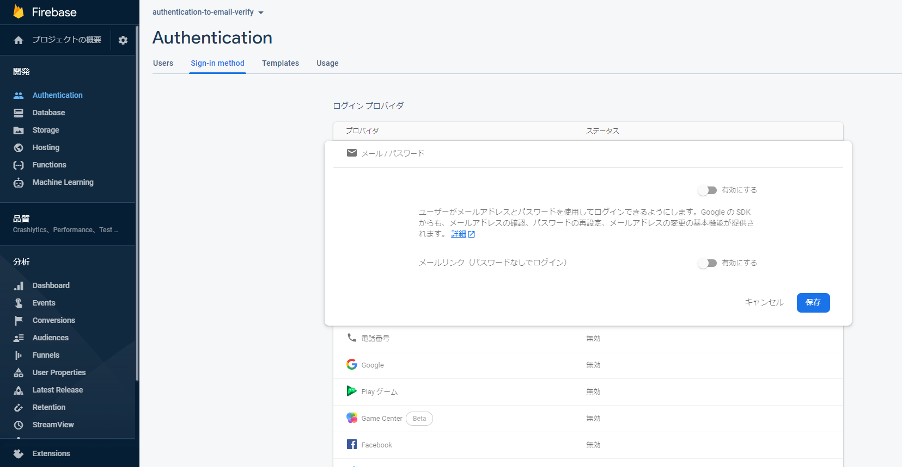

ここでは、FirebaseUIを使った、基本的なログイン機能の実装について説明していきます。

## FirebaseUIとは？
FirebaseUIとはFirebase Authenticationを使ったログイン機能の実装を簡単にするためにGoogleが用意してくれているライブラリです。FirebaseUI には次の利点があります。

- 複数プロバイダ対応
- アカウントのリンク
- カスタマイズ
- ワンタップ登録と自動ログイン
- ローカライズされた UI
- 匿名ユーザーのアップグレード

詳細については[公式ドキュメント](https://firebase.google.com/docs/auth/web/firebaseui?hl=ja)に書かれていますので、参照してください。

簡単に複数のプロバイダに対応したログイン機能を実装できるということで、今回はその手軽さを体験しつつ、基本的な実装方法について説明します。

## 進め方
今回は以下のように進めていきます。（プロジェクトの作成の部分は省かせていただきます。詳しくは別の記事で書こうと思います。）

1. プロジェクト作成
2. プロジェクトの初期化（設定）
3. FirebaseUIの準備
4. 認証状態表示とログアウトの準備
5. FirebaseUIの処理を追加

Firebaseの処理では、はじめにメールアドレスによる認証を試し、GoogleとGitHubの設定についても紹介します。

<div class="ads"></div>

## プロジェクトの初期化

まずはFirebaseのプロジェクトを初期化するところから始めます。

Firebaseのコンソールからプロジェクトを作成し、\[Authentication] で各種認証を有効にしましょう。はじめはメール・パスワードを試します。



その後、作業ディレクトリで以下のコマンドを実行して初期化します。

```bash:title=bash
firebase init
```

今回はHostingのみで十分です。プロジェクトは先ほどコンソールで作成したものを使います。

処理が終了すると`index.html`が生成されていると思います。初期では様々なFirebaseの機能を使えるようになっているので、必要なものだけに変更します。

```html:title=index.html
<!DOCTYPE html>
<html>

<head>
  <meta charset="utf-8">
  <meta name="viewport" content="width=device-width, initial-scale=1">
  <title>Firebase UI</title>
  <script src="/__/firebase/7.17.1/firebase-app.js"></script>
  <script src="/__/firebase/7.17.1/firebase-auth.js"></script>
  <script src="/__/firebase/init.js"></script>
</head>

<body>
</body>

</html>
```

```text:title=ファイル構成
public
  └── index.html
```

## FirebaseUIの準備

FirebaseUIは初期段階では用意されていないので、自分で追加が必要です。今回は[公式ページ](https://firebase.google.com/docs/auth/web/firebaseui?hl=ja)にあるいくつかの[追加方法](https://firebase.google.com/docs/auth/web/firebaseui?hl=ja#before_you_begin)のうちCDNを使った方法で導入します。

変更後の`index.html`がこちら

```html:title=index.html
<!DOCTYPE html>
<html>

<head>
  <meta charset="utf-8">
  <meta name="viewport" content="width=device-width, initial-scale=1">
  <title>Firebase UI</title>
  <script src="/__/firebase/7.17.1/firebase-app.js"></script>
  <script src="/__/firebase/7.17.1/firebase-auth.js"></script>
  <script src="/__/firebase/init.js"></script>
  <script src="https://cdn.firebase.com/libs/firebaseui/3.5.2/firebaseui.js"></script>
  <link type="text/css" rel="stylesheet" href="https://cdn.firebase.com/libs/firebaseui/3.5.2/firebaseui.css" />
</head>

<body>
</body>

</html>
```
<div class="ads"></div>

## 認証状態とログアウトの準備

FirebaseUIを使った認証機能の実装の前に、認証状態の表示とログアウト機能の実装をしておきます。

認証状態は`onAuthStateChanged`を用いて監視することができます。これは、一度実行しておくと解除するまで常に監視をし、認証状態が変わるごとに処理てくれます。

ログアウトは`signOut`を用います。特に引数があるわけでもないので非常に簡単です。

公式のドキュメントやリファレンスは以下の通りです。

[onAuthStateChanged](https://firebase.google.com/docs/reference/js/firebase.auth.Auth?authuser=0#onauthstatechanged)

[signOut](https://firebase.google.com/docs/reference/js/firebase.auth.Auth?authuser=0#signout)

```html:title=index.html
<!DOCTYPE html>
<html>

<head>
  <meta charset="utf-8">
  <meta name="viewport" content="width=device-width, initial-scale=1">
  <title>Firebase UI</title>
  <script src="/__/firebase/7.17.1/firebase-app.js"></script>
  <script src="/__/firebase/7.17.1/firebase-auth.js"></script>
  <script src="/__/firebase/init.js"></script>
  <script src="https://cdn.firebase.com/libs/firebaseui/3.5.2/firebaseui.js"></script>
  <link type="text/css" rel="stylesheet" href="https://cdn.firebase.com/libs/firebaseui/3.5.2/firebaseui.css" />
  <style>
    .Info {
      display: flex;
      justify-content: center;
      height: 48px;
      line-height: 48px;
    }

    .Info button {
      height: 24px;
      margin: 12px;
    }
  </style>
</head>

<body>
  <div class="Info">
    <div id="sign-in-status">Checking auth-state...</div>
    <button id="sign-out" onclick="signout()" style="display: none;">sign out</button>
  </div>
  <!-- script -->
  <script src="./index.js"></script>
</body>

</html>
```

```js:title=index.js
function signout() {
  firebase.auth().signOut()
    .then(() => {
      console.log('Signed out')
    })
}

firebase.auth().onAuthStateChanged((user) => {
  if (user) {
    document.getElementById('sign-in-status').innerText = 'Signed in'
    document.getElementById('sign-out').style.display = 'block'
  } else {
    document.getElementById('sign-in-status').innerText = 'Signed out'
    document.getElementById('sign-out').style.display = 'none'
  }
})
```

この段階でのファイル構成は以下のようになります。

```text:title=ファイル構成
public
  ├── index.html
  └── index.js
```

## FirebaseUIの処理を実装
いよいよ本題のFirebaseUIの実装です。基本的な流れとしては

1. SDKをインポート後、AuthUIを初期化
2. UIを表示するタグやその他設定をして、スタートする

というようになっています。

### AuthUIの初期化

１のAuthUIの初期化は以下の一行でできます。

```js:title=index.js
var ui = new firebaseui.auth.AuthUI(firebase.auth());
```

２の設定などを含めてスタートするには初期化時にできた`uiオブジェクト`から`start`をつかっておこないます。

```js:title=index.js
ui.start('<UIを表示するタグのセレクタ>', {
  // さまざまなオプション
});
```

ちなみに`UIを表示するタグ`は基本`id`でセレクタ指定するのですが、`class`で指定することも可能です。その場合は最初に対象となるタグにUIが描画されます。

### オプションの設定
さまざまなオプションがあるのですが今回は以下のように指定していきます。

|    オプション    |                                                                                                                        内容                                                                                                                        |
|:----------------:|:--------------------------------------------------------------------------------------------------------------------------------------------------------------------------------------------------------------------------------------------------:|
| signInFlow       | 各種プロバイダーに使用するサインインフローを指定できます。`redirect`と`popup`から選べて、デフォルトは`redirect`となっています。今回はページ遷移しない`popup`を採用したいので指定します。                                                                   |
| signInSuccessUrl | ログイン成功後にリダイレクトするURLです。`signInSuccessWithAuthResult`コールバックを使っていない場合、または、使っていて`true`が返却されない場合に必須の項目です。今回はコールバックを使用しないので指定します。値は現在のディレクトリで`'./'`とします。 |
| signInOptions    | 使用するプロバイダーのリストで必須です。配列で指定し、その順番でUIも表示されます。                                                                                                                                                                 |

プロバイダー以外の設定をしたコードが以下のようになります。

```html:title=index.html
<!DOCTYPE html>
<html>

<head>
  <meta charset="utf-8">
  <meta name="viewport" content="width=device-width, initial-scale=1">
  <title>Firebase UI</title>
  <script src="/__/firebase/7.17.1/firebase-app.js"></script>
  <script src="/__/firebase/7.17.1/firebase-auth.js"></script>
  <script src="/__/firebase/init.js"></script>
  <script src="https://cdn.firebase.com/libs/firebaseui/3.5.2/firebaseui.js"></script>
  <link type="text/css" rel="stylesheet" href="https://cdn.firebase.com/libs/firebaseui/3.5.2/firebaseui.css" />
  <style>
    .Info {
      display: flex;
      justify-content: center;
      height: 48px;
      line-height: 48px;
    }

    .Info button {
      height: 24px;
      margin: 12px;
    }
  </style>
</head>

<body>
  <div class="Info">
    <div id="sign-in-status">Checking auth-state...</div>
    <button id="sign-out" onclick="signout()" style="display: none;">sign out</button>
  </div>
  <div id="firebaseui-auth-container"></div>
  <!-- script -->
  <script src="./index.js"></script>
</body>

</html>
```

```js:title=index.js
function signout() {
  firebase.auth().signOut()
    .then(() => {
      console.log('Signed out')
    })
}

firebase.auth().onAuthStateChanged((user) => {
  if (user) {
    document.getElementById('sign-in-status').innerText = 'Signed in'
    document.getElementById('sign-out').style.display = 'block'
  } else {
    document.getElementById('sign-in-status').innerText = 'Signed out'
    document.getElementById('sign-out').style.display = 'none'
  }
})

var ui = new firebaseui.auth.AuthUI(firebase.auth());
console.log(typeof ui)
ui.start('#firebaseui-auth-container', {
  signInFlow: 'popup',
  signInSuccessUrl: './',
  signInOptions: [
    // プロバイダーの設定
  ]
});
```

### メール・パスワード認証
まずはメール・パスワード認証を試すところからいきましょう。

`signInOptions`のリストにメール プロバイダ ID を追加します。また、ユーザーに表示名の入力を求めることができますが、今回の目的とは離れるので設定をオフにしておきます。（デフォルトで`true`なので）

設定後のコードは以下のようになります。

```js:title=index.js
ui.start('#firebaseui-auth-container', {
  signInFlow: 'popup',
  signInSuccessUrl: './',
  signInOptions: [
    {
      provider: firebase.auth.EmailAuthProvider.PROVIDER_ID,
      requireDisplayName: false
    },
  ]
});
```

設定が済んだら、以下のコマンドを実行してデプロイします。

```bash:title=bash
firebase deploy
```

デプロイされたURLへアクセスして確認すると、以下のスクリーンショットような状態になっているはずです。


最後に、実際にサインアップして動作確認できれば、成功です。

※うまくいかない場合は設定の綴りやコンソールの[Authentication] ＞[Sign in Method]で対象のプロバイダーが有効になっているか確認してみてください。

### Googleで認証
Googleで認証は非常に簡単です。以下のように、Googleのプロバイダ ID を追加します。

```js:title=index.js
ui.start('#firebaseui-auth-container', {
  signInFlow: 'popup',
  signInSuccessUrl: './',
  signInOptions: [
    {
      provider: firebase.auth.EmailAuthProvider.PROVIDER_ID,
      requireDisplayName: false
    },
    {
      provider: firebase.auth.GoogleAuthProvider.PROVIDER_ID,
    },
  ]
});
```

次にFirebaseのコンソールの\[Authentication] ＞ \[Sign in Method] でGoogle認証を有効にしましょう。

設定が済んだら、先ほどと同じようにデプロイします。以下のスクリーンショットような状態になっているはずです。


### GitHubで認証
次はGitHubでの認証をやってみます。

[GitHubの設定画面](https://github.com/settings/profile)から下の方にある[DeveloppersSettings](https://github.com/settings/developers)を開き、`OAuth Apps`の`New OAuth App` ボタン（初めてGitHubにOAuthアプリを登録する場合は`Register a new OAuth application` ボタン）をクリックします。

以下のような画面が出てくるので、`Application name`には適当な名前を、`Homepage URL` と `Authorization callback URL` には、今回、認証を行うページのURLを入れ、登録します。（`Authorization callback URL`はあとで変更します。）


登録が完了したら、GitHubの登録したアプリのページ（アプリの設定画面 Settings / Developper settings / 先ほどのアプリ名）のページでGenerate a new client secretボタンをクリックしクライアントシークレットIDを作成します。

Firebaseコンソールを開き、\[Authentication] ＞ \[Sign in Method] でGitHubの設定を開き、先ほど作成したGitHubのアプリ設定から`クライアントID`と`クライアントシークレット`をコピーし張り付けます。クライアントシークレットの入力場所の下にある、`https://アプリのURL/__/auth/handler`をコピーし、GitHubの設定のAuthorization callback URLに張り付けて、設定を更新します。

後は、以下のようにGitHubのプロバイダ ID を追加すれば準備完了です。

```js:title=index.js
 ui.start('#firebaseui-auth-container', {
  signInFlow: 'popup',
  signInSuccessUrl: './',
  signInOptions: [
    {
      provider: firebase.auth.EmailAuthProvider.PROVIDER_ID,
      requireDisplayName: false
    },
    {
      provider: firebase.auth.GoogleAuthProvider.PROVIDER_ID,
    },
    {
      provider: firebase.auth.GithubAuthProvider.PROVIDER_ID,
    },
  ]
});
```

設定が済んだら、先ほどと同じようにデプロイします。以下のスクリーンショットような状態になっているはずです。


## まとめ
今回はFirebaseUIを使った、基本的なログイン機能の実装について説明していきました。TwitterやFacebookについても時間のある時に追加して書いていきたいと思います。