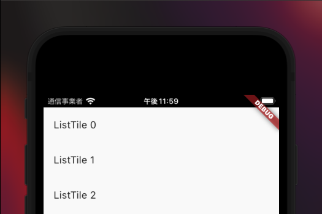
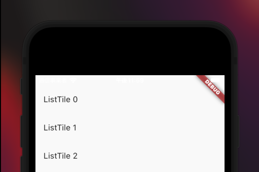

## はじめに

この記事はFlutter Widget of the Weekで紹介されたWidgetを使ってみることを目的としてます。
ざっくりとした使い方をコードとスクショをもとに紹介できたらと思います。

今回はSafeAreaです。

## 参考

<iframe width="560" height="315" src="https://www.youtube.com/embed/lkF0TQJO0bA" title="YouTube video player" frameborder="0" allow="accelerometer; autoplay; clipboard-write; encrypted-media; gyroscope; picture-in-picture" allowfullscreen></iframe>

- YouTube：[今週のFlutter Widget: SafeArea](https://www.youtube.com/watch?v=lkF0TQJO0bA)
- ドキュメント：[SafeArea class](https://api.flutter.dev/flutter/widgets/SafeArea-class.html)
- サンプルを実装してみたリポジトリ：[fujiya228/flutter_widget_of_the_week](https://github.com/fujiya228/flutter_widget_of_the_week)

## 概要

OSに依存する表示と被らないようにしてくれる。画面上部のステータスバーに被らないなどなど。

以下のようにSafeAreaで包んだ場合には被らないようになっている。

SafeAreaで包んだ場合


SafeAreaで包んでいない場合


<div class="ads"></div>

以下のコード：[GitHub](https://github.com/fujiya228/flutter_widget_of_the_week/blob/main/lib/widgets/pages/page001.dart)


```dart:title=SafeAreaで包んでいない場合
class WrapWithSafeArea extends StatelessWidget {
  const WrapWithSafeArea({Key? key}) : super(key: key);

  @override
  Widget build(BuildContext context) {
    return SafeArea(
      child: Scaffold(
        body: ListView(
          children: List.generate(
            20,
            (idx) => ListTile(title: Text('ListTile $idx')),
          ),
        ),
        floatingActionButton: const BackPageButton(),
      ),
    );
  }
}
```

```dart:title=SafeAreaで包んでいない場合
class NotWrapWithSafeArea extends StatelessWidget {
  const NotWrapWithSafeArea({Key? key}) : super(key: key);

  @override
  Widget build(BuildContext context) {
    return Scaffold(
      body: ListView(
        children: List.generate(
          20,
          (idx) => ListTile(title: Text('ListTile $idx')),
        ),
      ),
      floatingActionButton: const BackPageButton(),
    );
  }
}
```

<div class="ads"></div>
