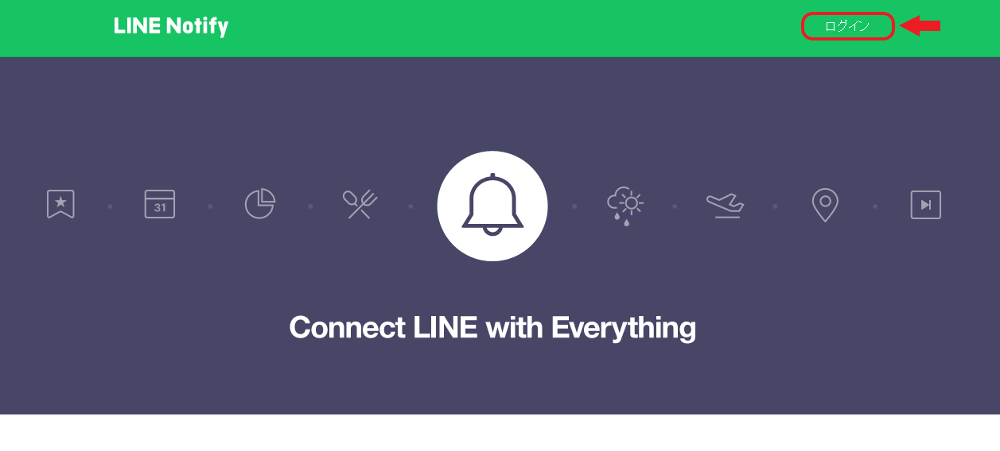
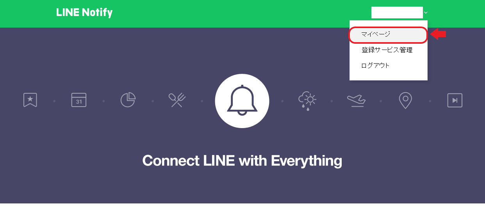
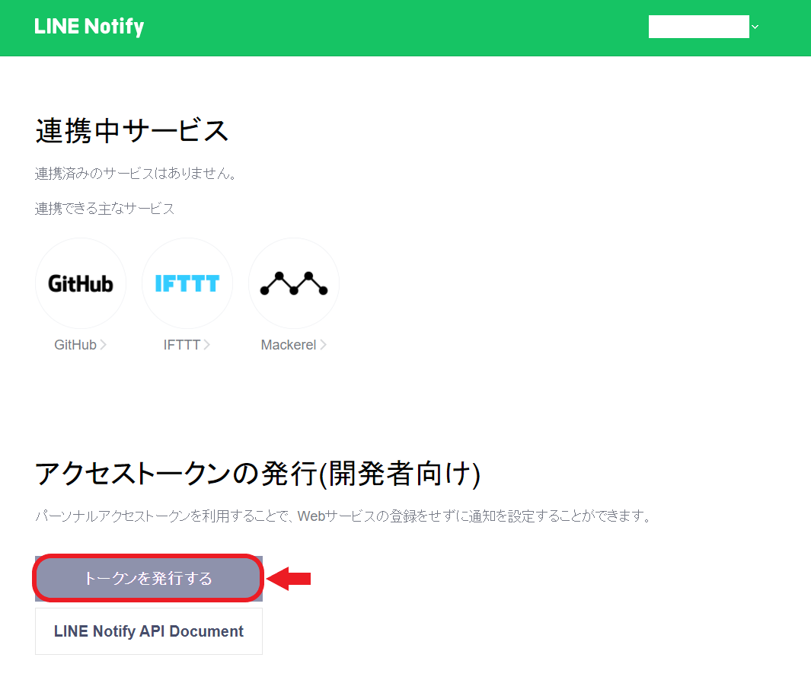
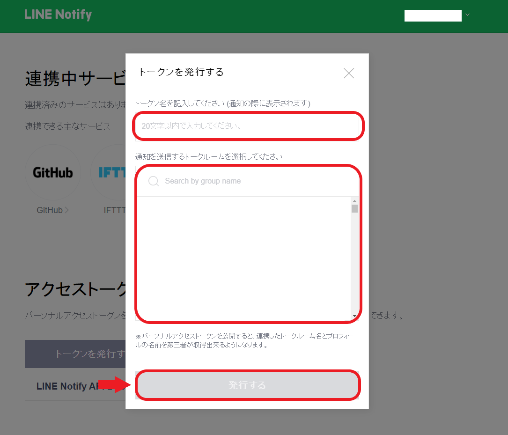
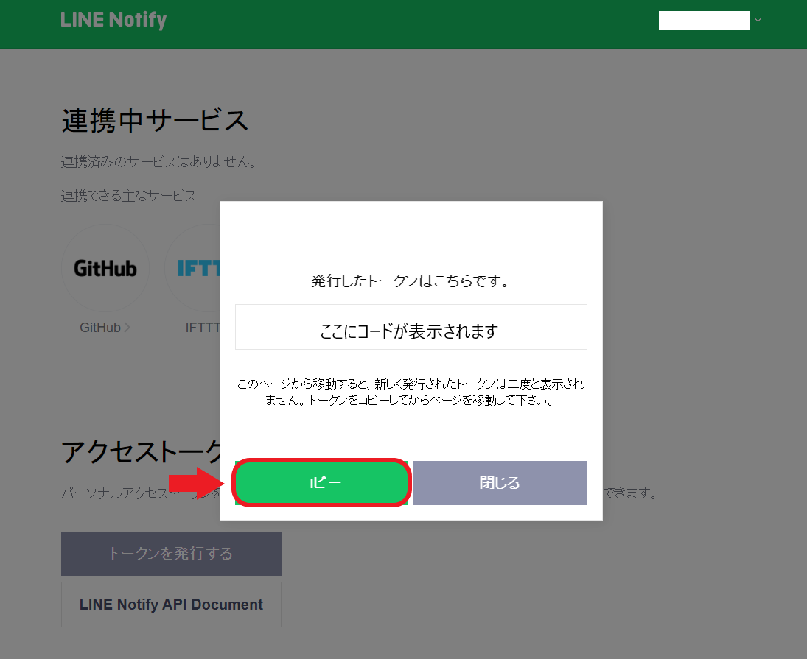

Pythonを少し使えるようになった！何か身の回りで使えそうなものを作りたい！今回はそういった方向けに、Pythonで定期的にLINE Notifyへ通知を送る方法を紹介します。

## 今回必要なもの

今回実装するのに必要なものです。

- LINEのアカウント
- Pythonが動く環境
- 定期的に実行できる環境（今回はcronを使います）

今回はcronを使って定期的に実行を行います。それに伴ってWindowsユーザーにはWSL（Windows Subsystem for Linux ）のインストールを行っていただく必要があります。WindowsでPython環境をお使いの方は、そちらでは動かさないのでご注意ください。

[Windows 10 用 Windows Subsystem for Linux のインストール ガイド](https://docs.microsoft.com/ja-jp/windows/wsl/install-win10)

[Windowsで環境を極力汚さずにPythonを動かす方法 (WSL利用 Windows10, version 1607以降限定)](https://qiita.com/rhene/items/ff11c7850a9a7617c50f)

[Pythonの開発環境を用意しよう！（Mac）](https://prog-8.com/docs/python-env)

[macOS環境のPython – python.jp](https://www.python.jp/install/macos/index.html)

## 実行環境の準備
まずは以下のコマンドで仮想環境を作ります。（ 今回はvenvという名前で作ります。）

```bash:title=bash
python3 -m venv venv
```

次に以下のコマンドでアクティベートしておきましょう。

```bash:title=bash
source venv/bin/activate
```

## LINE Notifyの準備
今回はLINE NotifyをPythonを使って利用します。

LINE Notifyとは

> Webサービスと連携すると、LINEが提供する公式アカウント”LINE Notify”から通知が届きます。
複数のサービスと連携でき、グループでも通知を受信することが可能です。
引用：[LINE Notify](https://notify-bot.line.me/ja/)

ここで必要な作業はトークンの発行です。以下の手順に従ってトークンを発行しましょう。

1. LINE Notifyへアクセスしログイン
2. マイページへ移動
3. トークンを発行するを押す
4. トークン名の記入、通知を送信するトークルームを選択し発行
5. トークンをコピー

1．[LINE Notify](https://notify-bot.line.me/ja/)へアクセスしログイン



2．[マイページ](https://notify-bot.line.me/my/)へ移動



3．トークンを発行するを押す



4．トークン名の記入、通知を送信するトークルームを選択し発行



5．トークンをコピー



トークンが発行されるとLINE Notifyにトークン発行の通知がいきます。

## Pythonで送信する

### コードを書く
次に必要なパッケージのインストールとPythonで通知を送信するコードを[LINE Notify API Document](https://notify-bot.line.me/doc/ja/)に従って書いていきます。ひとまずコードの紹介から。

```bash:title=bash
pip install requests
```

```python:title=Python
import requests
token = "ここに先ほど作成したトークンを入れます"
endpoint = "https://notify-api.line.me/api/notify"
headers = {"Authorization": "Bearer " + token}
params = {"message": "test message"}
requests.post(endpoint, headers=headers, data=params)
```

### 実行してみる
以下のコマンドで実行してみましょう。

```bash:title=bash
python3 上記のコードを記述したファイル名.py
```

LINE Notifyに「test message」と表示されていたら成功です。

### コードの解説
[公式のドキュメント](https://notify-bot.line.me/doc/ja/)からリクエスト方法とリクエストパラメータを確認してみましょう。

エンドポイントは`https://notify-api.line.me/api/notify`です。

**リクエスト方法**

| リクエストメソッド/ヘッダ |                            値                            |
|:-------------------------:|:--------------------------------------------------------:|
| Method                    | POST                                                     |
| Content-Type              | application/x-www-form-urlencoded OR multipart/form-data |
| Authorization             | Bearer [access_token]                                    |

リクエストパラメータ

必須のパラメータは`message`のみです。最大 1000文字まで送信可能のようです。

その他にも画像やスタンプを送ることもできます。（後ほどスタンプも紹介します）

今回は`requests`というHTTP通信用のライブラリを使います。

それぞれ必要なパラメータを設定し、`requests.post`メソッドに渡してリクエストします。

※Content-Typeは無くてもできましたが、いざ指定すると`application/x-www-form-urlencoded`の方しかできませんでした。

とても扱いやすいライブラリです。詳しい使い方は公式の[クイックスタート](https://requests-docs-ja.readthedocs.io/en/latest/user/quickstart/)をご覧ください。

## 定期的に通知する
今回は先ほどのコードをcronを用いて定期的に実行することで、通知を定期的に行います。

### cronの設定
以下のコマンドでcronの設定を行っていきます。

```bash:title=bash
crontab -e
```

コマンドを実行すると、設定を入力できるようになるので以下の書式に従って設定します。

```bash:title=bash
(分)(時)(日)(月)(曜日) 実行するコマンドのパス
```

```bash:title=例
# 10分ごとに通知
*/10 * * * * python3 フォルダへのパス/記述したファイル名.py
```

WSLからWindowsのファイルへアクセスする場合はフォルダへのパスが

```text:title=path
/mnt/ドライブ/...... 
```

などとなります。詳しくは以下で詳しく説明されています。

[WSL (Windows Subsystem for Linux)の基本メモ](https://qiita.com/rubytomato@github/items/fdfc0a76e848442f374e)

### cronのスタート
設定が済んだらcronが実行されているか確認します。（cronがデフォルトで無効になっていることもあるので）以下のコマンドで確認しましょう。

```bash:title=bash
 # WSL
 sudo service cron status
 # Mac
 cron status
 ```

 もし実行されていない場合には、以下のコマンドで実行します。


```bash:title=bash
 # WSL
 sudo service cron start
 # Mac
 cron start
 ```

 後は実行されるを待つのみです！

 ### 注意点１
Macユーザーの方でPythonをbrew+pyenvで行っている方は、上記でPythonが実行できない場合があります。

その際にはpythonへのパスをフルパスで記述することで解決できます。

```bash:title=bash
# フルパスの確認
which python
```

### 注意点２
また、それでも実行できない場合には、**フルディスクアクセスに cron を追加**する必要があります。

以下をを参考に解決してください。

[macOS 10.15 catalina で crontab を使用する](https://mac-ra.com/catalina-crontab/)

## スタンプを通知に含める
LINE Notifyではテキスト以外に画像やスタンプなども通知できます。ここでは、スタンプの通知の仕方を紹介します。

基本的に先ほどのコードと同じで、スタンプの設定を追加します。

```python:title=Python
import requests
token = "ここに先ほど作成したトークンを入れます"
endpoint = "https://notify-api.line.me/api/notify"
headers = {"Authorization": "Bearer " + token}
params = {
  "message": "test message",
  "stickerPackageId": "1",
  "stickerId": "1"
}
requests.post(endpoint, headers=headers, data=params)
```

`sitckerPackageId`と`stickerId`は次のリンクから参照することができます。

[sticker_list.pdf](https://devdocs.line.me/files/sticker_list.pdf)

[Sticker_list_20190808](https://developers.line.biz/media/messaging-api/sticker_list.pdf)(こちらはうまく動作しませんでした。また調査したいです。)

## まとめ
今回はPythonで定期的にLINE Notifyへ通知を送る方法を紹介しました。

これらを発展させれば、身の回りで役に立つものが作れそうです。