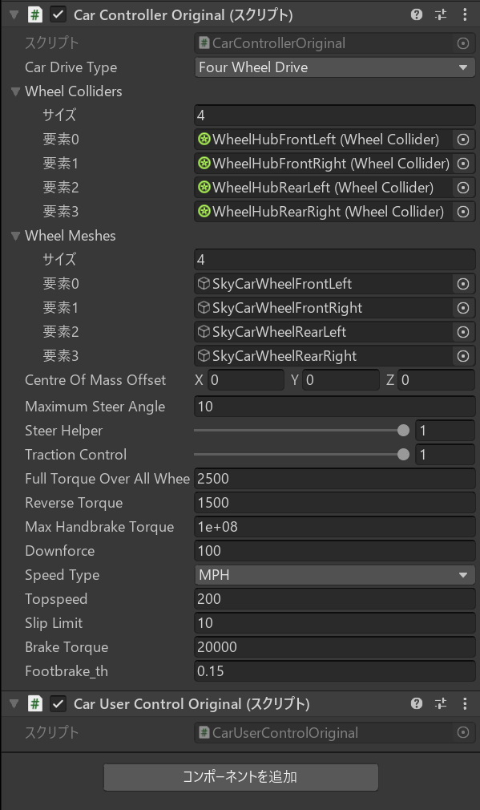

[Logitech G29のセットアップ](https://fujiya228.com/unity-logitech-g29-setup/)と[基本の関数の使い方](https://fujiya228.com/unity-logitech-steering-wheel-sdk/)を解説しました。あとは車を走らせるだけ！ということで、今回はLogitech G29を使ってUnityで車を走らせます。

**参考**

[Logitech G29を使うためにLogitechSDKをセットアップ-Unity](https://fujiya228.com/unity-logitech-g29-setup/)

[LogitechSDKのLogitechSteeringWheelを使ってみる-Unity](https://fujiya228.com/unity-logitech-steering-wheel-sdk/)

## Standard Assetsのインポート

今回はStandard Assetsを参考に車を動かします。Standard AssetsをAssetStoreからダウンロード・インポートしましょう。

### エラー解決

インポートしたところ以下のようなエラーが発生しました。

<!--  -->


SimpleActivatorMenu.csを変更します。

```csharp:title=Console
// SimpleActivatorMenu.cs

// 以下を追加
using UnityEngine.UI;

// 以下のように変更
public GUIText camSwitchButton;
↓
public Text camSwitchButton;
```

### 参考にする車とスクリプト

今回、使用・参考にするStandard Assetsの車とスクリプトについて紹介します。

以下が今回使う車です。（Standard Assets > Vehicles > Car > Prefabs > Car）


この車に、入力を制御するスクリプトCarUserControl.csとこの入力から車を動かすスクリプトCarController.csがアタッチされています。

これらを変更していきます。

## CarController.cs

デフォルトからエフェクトの削除やブレーキの変更などを行います。

変更は大まかに

- ApplyDriveのブレーキ変更
- CalculateRevs関連の削除
- CheckForWheelSpin関連の削除

です。

### 完成版

完成版のスクリプト（CarControllerOriginal.cs）は以下の通りです。

```csharp:title=CarControllerOriginal.cs
using System;
using UnityEngine;
using UnityEngine.UI;

#pragma warning disable 649
namespace LogitechSDK
{
    internal enum CarDriveType
    {
        FrontWheelDrive,
        RearWheelDrive,
        FourWheelDrive
    }

    internal enum SpeedType
    {   
        MPH,
        KPH
    }

    public class CarControllerOriginal : MonoBehaviour
    {
        [SerializeField] private CarDriveType m_CarDriveType = CarDriveType.FourWheelDrive;
        [SerializeField] private WheelCollider[] m_WheelColliders = new WheelCollider[4];
        [SerializeField] private GameObject[] m_WheelMeshes = new GameObject[4];
        [SerializeField] private Vector3 m_CentreOfMassOffset;
        [SerializeField] private float m_MaximumSteerAngle = 10;
        [Range(0, 1)] [SerializeField] private float m_SteerHelper = 1; // 0 is raw physics , 1 the car will grip in the direction it is facing
        [Range(0, 1)] [SerializeField] private float m_TractionControl = 1; // 0 is no traction control, 1 is full interference
        [SerializeField] private float m_FullTorqueOverAllWheels = 2500;
        [SerializeField] private float m_ReverseTorque = 1500;
        [SerializeField] private float m_MaxHandbrakeTorque = 100000000;
        [SerializeField] private float m_Downforce = 100f;
        [SerializeField] private SpeedType m_SpeedType;
        [SerializeField] private float m_Topspeed = 200;
        [SerializeField] private float m_SlipLimit = 10;
        [SerializeField] private float m_BrakeTorque = 20000;
        // original
        [SerializeField] private float footbrake_th=0.15f; // 時々ペダルが戻りきらなくなる結果、常に踏んだ状態となる。止まりっぱなしになるのを避けるため

        private Quaternion[] m_WheelMeshLocalRotations;
        private Vector3 m_Prevpos, m_Pos;
        private float m_SteerAngle;
        private float m_GearFactor;
        private float m_OldRotation;
        private float m_CurrentTorque;
        private Rigidbody m_Rigidbody;
        private const float k_ReversingThreshold = 0.01f;

        public bool Skidding { get; private set; }
        public float BrakeInput { get; private set; }
        public float CurrentSteerAngle{ get { return m_SteerAngle; }}
        public float CurrentSpeed{ get { return m_Rigidbody.velocity.magnitude*2.23693629f; }}
        public float MaxSpeed{get { return m_Topspeed; }}
        public float Revs { get; private set; }
        public float AccelInput { get; private set; }

        // Use this for initialization
        private void Start()
        {
            m_WheelMeshLocalRotations = new Quaternion[4];
            for (int i = 0; i < 4; i++)
            {
                m_WheelMeshLocalRotations[i] = m_WheelMeshes[i].transform.localRotation;
            }
            m_WheelColliders[0].attachedRigidbody.centerOfMass = m_CentreOfMassOffset;

            m_MaxHandbrakeTorque = float.MaxValue;

            m_Rigidbody = GetComponent<Rigidbody>();
            m_CurrentTorque = m_FullTorqueOverAllWheels - (m_TractionControl*m_FullTorqueOverAllWheels);
        }

        public void Move(float steering, float accel, float footbrake, float handbrake)
        {
            for (int i = 0; i < 4; i++)
            {
                Quaternion quat;
                Vector3 position;
                m_WheelColliders[i].GetWorldPose(out position, out quat);
                m_WheelMeshes[i].transform.position = position;
                m_WheelMeshes[i].transform.rotation = quat;
            }

            //clamp input valuesFR
            steering = Mathf.Clamp(steering, -1, 1);
            AccelInput = accel = Mathf.Clamp(accel, -1, 1);
            BrakeInput = footbrake = Mathf.Clamp(footbrake, 0, 1);
            handbrake = Mathf.Clamp(handbrake, 0, 1);

            //Set the steer on the front wheels.
            //Assuming that wheels 0 and 1 are the front wheels.
            m_SteerAngle = steering*m_MaximumSteerAngle;
            m_WheelColliders[0].steerAngle = m_SteerAngle;
            m_WheelColliders[1].steerAngle = m_SteerAngle;

            SteerHelper();
            ApplyDrive(accel, footbrake);
            CapSpeed();

            //Set the handbrake.
            //Assuming that wheels 2 and 3 are the rear wheels.
            if (handbrake > 0f)
            {
                var hbTorque = handbrake*m_MaxHandbrakeTorque;
                m_WheelColliders[2].brakeTorque = hbTorque;
                m_WheelColliders[3].brakeTorque = hbTorque;
            }

            AddDownForce();
            TractionControl();
        }

        private void CapSpeed()
        {
            float speed = m_Rigidbody.velocity.magnitude;
            switch (m_SpeedType)
            {
                case SpeedType.MPH:

                    speed *= 2.23693629f;
                    if (speed > m_Topspeed)
                        m_Rigidbody.velocity = (m_Topspeed/2.23693629f) * m_Rigidbody.velocity.normalized;
                    break;

                case SpeedType.KPH:
                    speed *= 3.6f;
                    if (speed > m_Topspeed)
                        m_Rigidbody.velocity = (m_Topspeed/3.6f) * m_Rigidbody.velocity.normalized;
                    break;
            }
        }

        private void ApplyDrive(float accel, float footbrake)
        {

            float thrustTorque = 0;
            switch (m_CarDriveType)
            {
                case CarDriveType.FourWheelDrive:
                    thrustTorque = accel * (m_CurrentTorque / 4f);
                    for (int i = 0; i < 4; i++)
                    {
                        m_WheelColliders[i].motorTorque = thrustTorque;
                    }
                    break;

                case CarDriveType.FrontWheelDrive:
                    thrustTorque = accel * (m_CurrentTorque / 2f);
                    m_WheelColliders[0].motorTorque = m_WheelColliders[1].motorTorque = thrustTorque;
                    m_WheelColliders[2].motorTorque = m_WheelColliders[3].motorTorque = 0;
                    break;

                case CarDriveType.RearWheelDrive:
                    thrustTorque = accel * (m_CurrentTorque / 2f);
                    m_WheelColliders[0].motorTorque = m_WheelColliders[1].motorTorque = 0;
                    m_WheelColliders[2].motorTorque = m_WheelColliders[3].motorTorque = thrustTorque;
                    break;

            }

            // ブレーキ部分
            // 速度や向きによってブレーキのかけ方を変えている
            float Angle = Vector3.Angle(transform.forward, m_Rigidbody.velocity); // 車体正面と速度の方向のなす角
            float curtBrakeTorque;
            float addMotorTorqueValue;
            if (footbrake > footbrake_th){
                if (CurrentSpeed > 1) // 速度が５より大きい
                {
                    curtBrakeTorque = 0f;
                    if (Angle < 50f) { // 前方に（左右50度ずつの範囲）に進んでいる
                        addMotorTorqueValue = -m_ReverseTorque*footbrake;
                    } else { // 後方に進んでいる
                        addMotorTorqueValue = m_ReverseTorque*footbrake;
                    }
                } else { // 速度が５以下
                    curtBrakeTorque = m_BrakeTorque*footbrake;
                    addMotorTorqueValue = 0f;
                }
            } else curtBrakeTorque = addMotorTorqueValue = 0f;
            for (int i = 0; i < 4; i++)
            {
                m_WheelColliders[i].brakeTorque = curtBrakeTorque;
                m_WheelColliders[i].motorTorque += addMotorTorqueValue;
            }
        }

        private void SteerHelper()
        {
            for (int i = 0; i < 4; i++)
            {
                WheelHit wheelhit;
                m_WheelColliders[i].GetGroundHit(out wheelhit);
                if (wheelhit.normal == Vector3.zero)
                    return; // wheels arent on the ground so dont realign the rigidbody velocity
                            // 地面にないので調整する必要なし
            }

            // this if is needed to avoid gimbal lock problems that will make the car suddenly shift direction
            if (Mathf.Abs(m_OldRotation - transform.eulerAngles.y) < 10f)
            {
                var turnadjust = (transform.eulerAngles.y - m_OldRotation) * m_SteerHelper;
                Quaternion velRotation = Quaternion.AngleAxis(turnadjust, Vector3.up);
                m_Rigidbody.velocity = velRotation * m_Rigidbody.velocity;
            }
            m_OldRotation = transform.eulerAngles.y;
        }

        // this is used to add more grip in relation to speed
        // タイヤがアタッチされているRigidbodyに下に向けた力を加えグリップを増やす
        private void AddDownForce()
        {
            m_WheelColliders[0].attachedRigidbody.AddForce(-transform.up*m_Downforce*
                                                         m_WheelColliders[0].attachedRigidbody.velocity.magnitude);
        }

        // crude traction control that reduces the power to wheel if the car is wheel spinning too much
        private void TractionControl()
        {
            WheelHit wheelHit;
            switch (m_CarDriveType)
            {
                case CarDriveType.FourWheelDrive:
                    // loop through all wheels
                    for (int i = 0; i < 4; i++)
                    {
                        m_WheelColliders[i].GetGroundHit(out wheelHit);

                        AdjustTorque(wheelHit.forwardSlip);
                    }
                    break;

                case CarDriveType.RearWheelDrive:
                    m_WheelColliders[2].GetGroundHit(out wheelHit);
                    AdjustTorque(wheelHit.forwardSlip);

                    m_WheelColliders[3].GetGroundHit(out wheelHit);
                    AdjustTorque(wheelHit.forwardSlip);
                    break;

                case CarDriveType.FrontWheelDrive:
                    m_WheelColliders[0].GetGroundHit(out wheelHit);
                    AdjustTorque(wheelHit.forwardSlip);

                    m_WheelColliders[1].GetGroundHit(out wheelHit);
                    AdjustTorque(wheelHit.forwardSlip);
                    break;
            }
        }

        private void AdjustTorque(float forwardSlip)
        {
            if (forwardSlip >= m_SlipLimit && m_CurrentTorque >= 0)
            {
                m_CurrentTorque -= 100 * m_TractionControl;
            }
            else
            {
                m_CurrentTorque += 100 * m_TractionControl;
                if (m_CurrentTorque > m_FullTorqueOverAllWheels)
                {
                    m_CurrentTorque = m_FullTorqueOverAllWheels;
                }
            }
        }
    }
}
```

## CarUserControl.cs

LogitechSDKの基本の関数の使い方で解説したものをもとにデフォルトを変更します。

クラッチは面倒だったのでバックするペダルにしました。

変更は入力をLogitechSDKから取得することです。

### 完成版

```csharp:title=CarUserControlOriginal.cs
using System;
using UnityEngine;

namespace LogitechSDK
{
    [RequireComponent(typeof(CarControllerOriginal))]
    public class CarUserControlOriginal : MonoBehaviour
    {
        private CarControllerOriginal m_Car; // the car controller we want to use

        private void Awake()
        {
            // get the car controller
            m_Car = GetComponent<CarControllerOriginal>();
            Debug.Log("SteeringInit:" + LogitechGSDK.LogiSteeringInitialize(false));
        }

        private void FixedUpdate()
        {
            if (!LogitechGSDK.LogiIsPlaying(0, LogitechGSDK.LOGI_FORCE_SPRING))
            {
                // ハンドルに中心に向けた力を加えるように設定
                LogitechGSDK.LogiPlaySpringForce(0, 0, 30, 100);
            }
            if (LogitechGSDK.LogiUpdate() && LogitechGSDK.LogiIsConnected(0))
            {
                //CONTROLLER STATE
                LogitechGSDK.DIJOYSTATE2ENGINES rec = LogitechGSDK.LogiGetStateUnity(0);
                float steering = rec.lX / 32768f;               // ハンドル
                float accel = rec.lY / 65536f + 0.5f;           // アクセル
                float brake = rec.lRz / 65536f + 0.5f;          // ブレーキ
                float back = rec.rglSlider[0] / 65536f + 0.5f;  // バック
                Debug.Log(steering);

#if !MOBILE_INPUT
                float handbrake;
                handbrake = 0; // 今回はハンドブレーキは、なしで
                if (System.Math.Abs(steering) < 0.01) steering = 0; // 中心に向けた力が加わらない範囲は直進
                m_Car.Move(steering, 0.6f + back * 0.5f - accel, 1 - brake, handbrake);
#else
                m_Car.Move(steering, 1, 0, 0);
#endif
            }
        }
    }
}
```

## 車の準備

Standard AssetsのCarプレハブ（Standard Assets > Vehicles > Car > Prefabs > Car）から今回必要となる部分に絞るため、いろいろ削除していきます。

- CarController、CarUserControl、CarAudioを削除
- CarControllerOriginal、CarUserControlOriginalを追加
- Carの中のLights、Particles、Helperを削除
- CarのWheelHubsにあるobjectからWheelEffectsとAudioSourceを省く
- SkyCarの中のSkyCarBrakeLightsGlowを削除
- SkyCarの中のSkyCarMudGuardFront 2つを削除（またはこれらのSuspentionとMudguardを削除）

削除後の状態が以下。CarにCarControllerOriginal.csとCarUserControlOriginal.csをアタッチしていればいいです。


今回はプレハブから削除しておりいらない部分もまだ残っています。最低限必要なのはBodyにリジッドボディー、Bodyのコライダー、タイヤ4輪、タイヤ4輪のコライダーで以下です。


また、CarControllerOriginalのWheelColliders、WheelMeshesにそれぞれCollider等をアタッチしておきます。



## 実際に走らせる

あとはTerrainなどで地面を作り、先ほどの車を走らせるだけです。


## まとめ

これで、[Logitech G29のセットアップ](https://fujiya228.com/unity-logitech-g29-setup/)と[基本の関数の使い方](https://fujiya228.com/unity-logitech-steering-wheel-sdk/)をから、車を走らせるところまでできました。これを用いて車を使ったシミュレーションシステムなどを作っていきたいです。

[Logitech G29を使うためにLogitechSDKをセットアップ-Unity](https://fujiya228.com/unity-logitech-g29-setup/)

[LogitechSDKのLogitechSteeringWheelを使ってみる-Unity](https://fujiya228.com/unity-logitech-steering-wheel-sdk/)