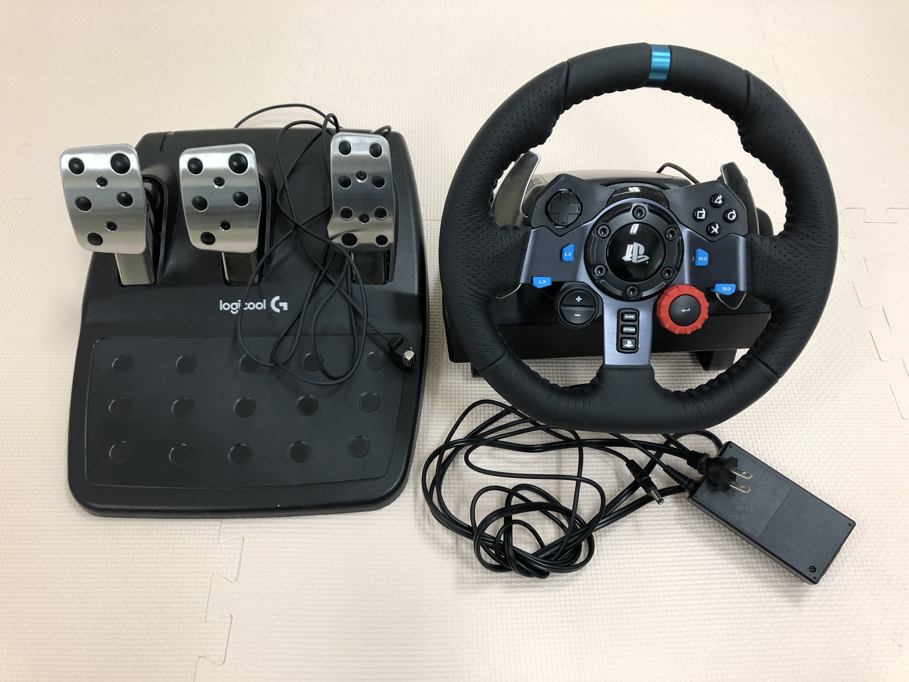
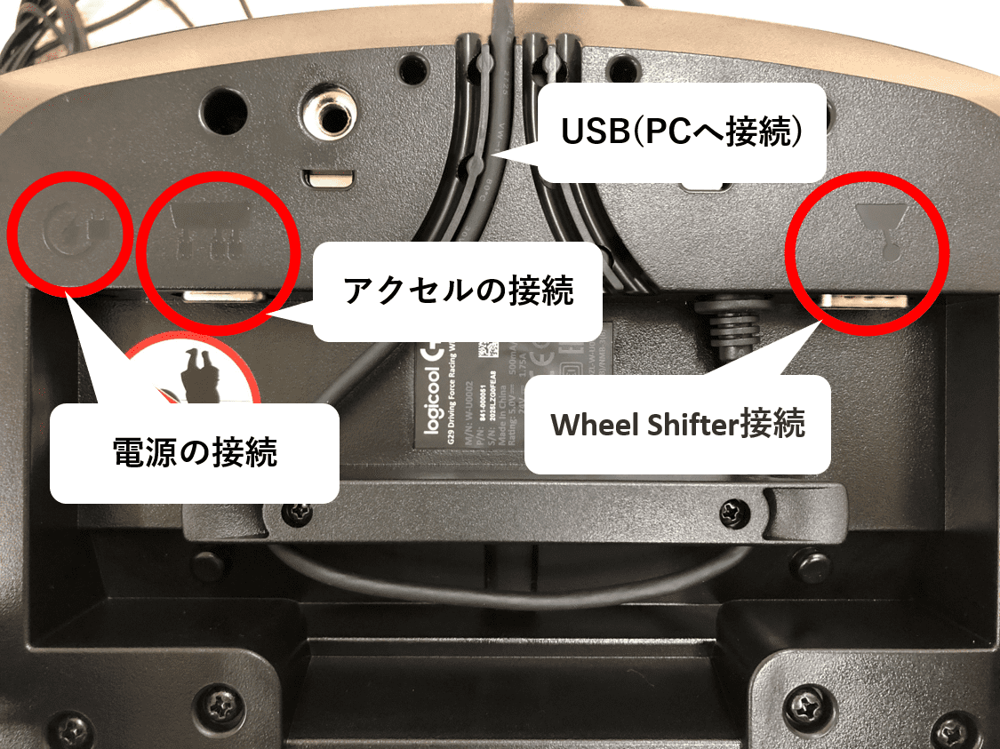
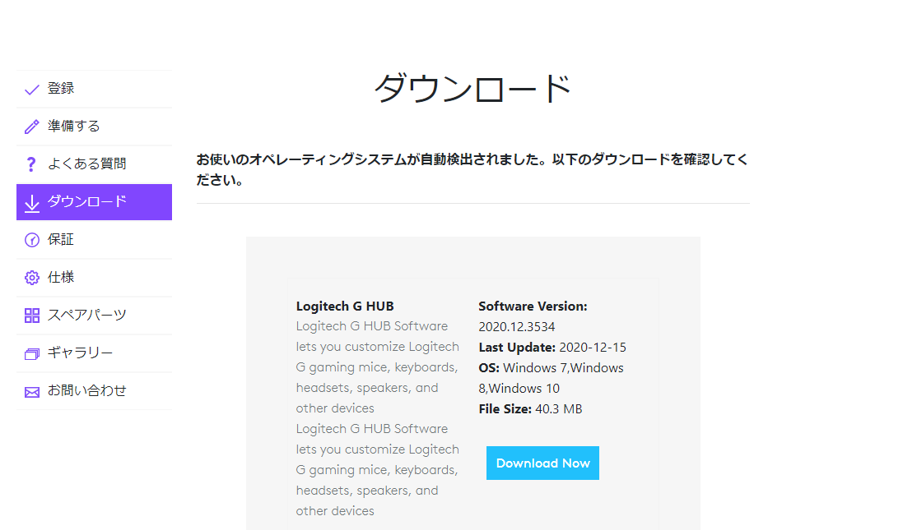
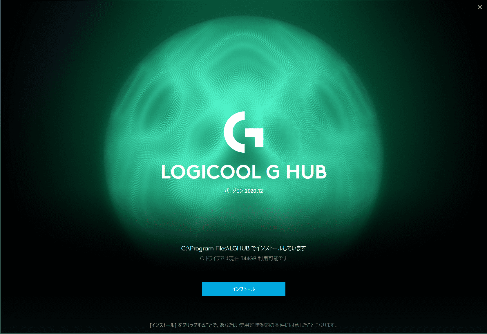
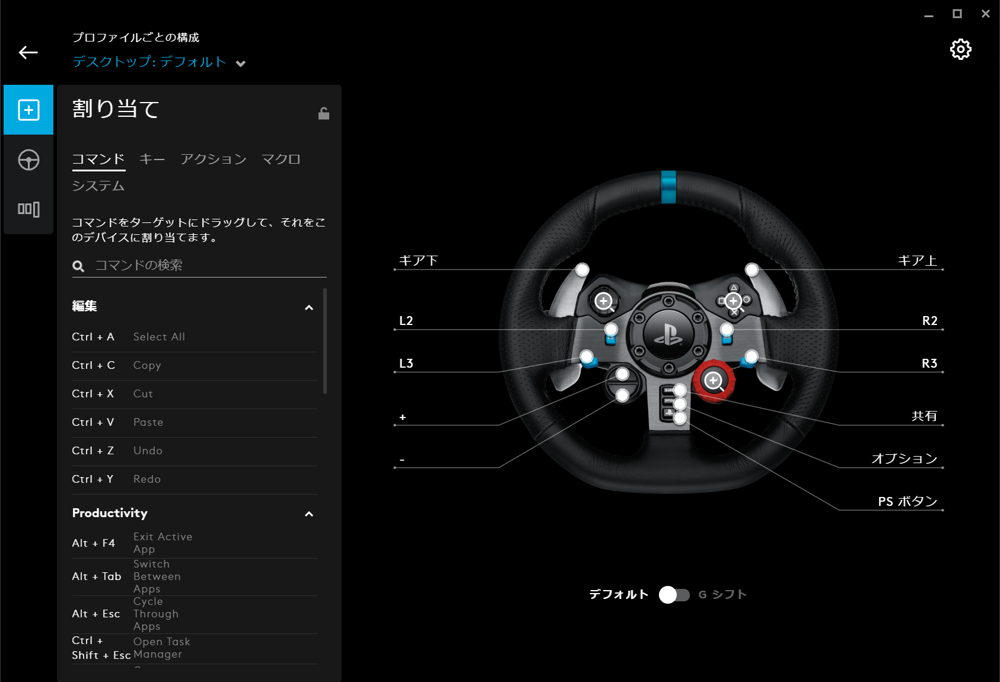
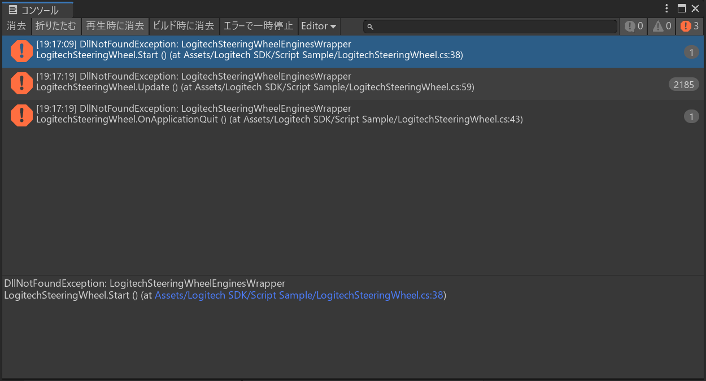
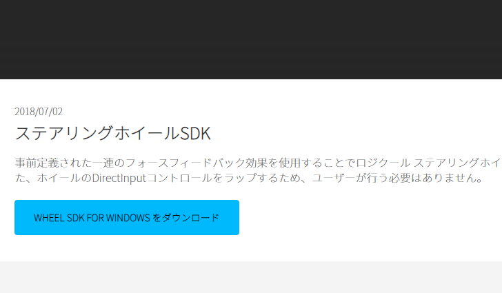
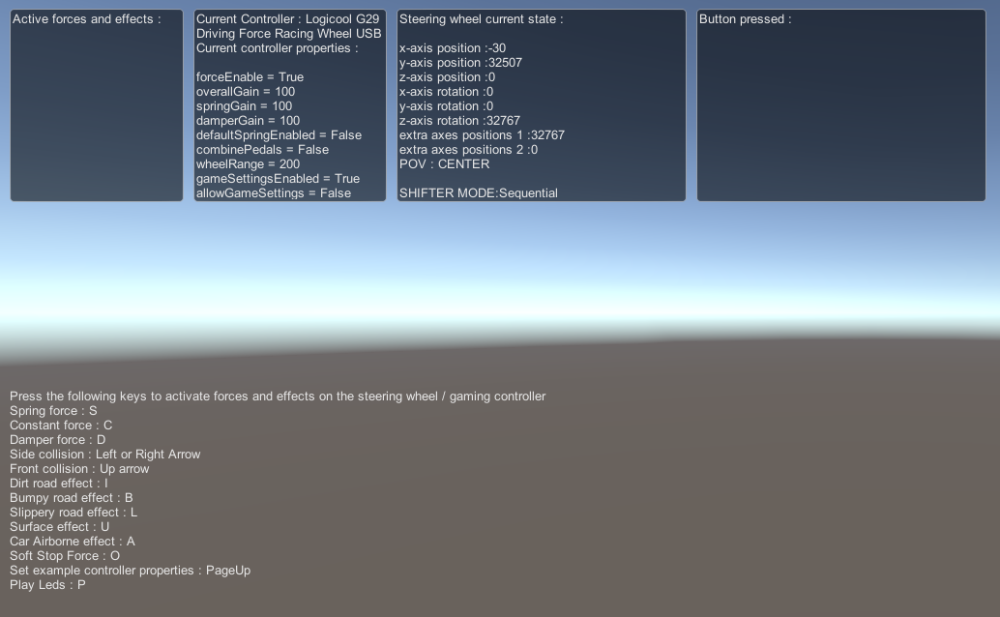

Logitech G29をUnityで使いたい人向けの導入記事です。

## PCへの接続

今回使うものを紹介します。



以下の画像の箇所に必要なものを接続しましょう。



## Logitech G HUB Softwareのインストール

公式ページから最新版のソフトウェアのインストーラをダウンロードします。

[ダウンロード - G29 Driving Force Racing Wheel](https://support.logi.com/hc/ja/articles/360024850133)



手順通りに進めてインストール。



**なくても動くみたいです。**
今回は取り扱わないですが割り当てやペダル感度などの設定ができます。




## Logitech Gaming SDKのインストール

UnityのアセットストアでLogitech Gaming SDKのインストールします。

[Logitech Gaming SDK | Integration | Unity Asset Store](https://assetstore.unity.com/packages/tools/integration/logitech-gaming-sdk-6630)

<div class="ads"></div>

## サンプルを使う

新しくシーンを作成して、空のオブジェクトを追加。

以下の場所にあるLogitechSteeringWheel.csを空のオブジェクトにアタッチしましょう。

```bash:title=File
Assets
└ Logitech SDK
	└ Script Sample
		└ LogitechSteeringWheel.cs
```

<div class="ads"></div>

## エラー解決

### アセットストアのSDKでは動かない

以下でも言われている通り、アセットストアで取得したSDKそのままでは動かない...。

[Logitech G29 SteeringWheel PCでUnityできるまで - Qiita](https://qiita.com/mmt/items/4de0646118c37c952b19)



公式から修正版をダウンロードして更新する必要があるみたいです。



修正版⇒[STEERING WHEEL SDK](https://gaming.logicool.co.jp/ja-jp/partnerdeveloperlab/sdk-resource-list/steering-wheel-sdk.html)


### SDKダウンロードできない

しかし、安全でない接続でリダイレクトされたとのことでダウンロード失敗する...。

コンソール確認すると以下のようなエラーが出ててダウンロードできなかったが、
**以下のURLへ直接アクセスするとダウンロードできました。**

[http://www.logitechg.com/sdk/LogitechSteeringWheelSDK_8.75.30.zip](http://www.logitechg.com/sdk/LogitechSteeringWheelSDK_8.75.30.zip)

```bash:title=console
Mixed Content: The site at '[https://gaming.logicool.co.jp/](https://gaming.logicool.co.jp/)' was loaded over a secure connection, 
but the file at '[http://www.logitechg.com/sdk/LogitechSteeringWheelSDK_8.75.30.zip](http://www.logitechg.com/sdk/LogitechSteeringWheelSDK_8.75.30.zip)' was redirected through an insecure connection. 
This file should be served over HTTPS. This download has been blocked. 
See [https://blog.chromium.org/2020/02/protecting-users-from-insecure.html](https://blog.chromium.org/2020/02/protecting-users-from-insecure.html) for more details.
```

### 上書きしてもう一度

上記でダウンロードした修正版SDKをアセットストアで取得したものに上書きしましょう。

```bash:title=File
// 修正版SDK
LogitechSteeringWheelSDK_8.75.30
└ Lib
	└ GameEnginesWrapper
		└ x64
			└ LogitechSteeringWheelEnginesWrapper.dll

// Unity側
Assets
└ Logitech SDK
	└ LogitechSteeringWheelEnginesWrapper.dll
```

※プロジェクトごとに上書きする必要があるので注意が必要です。

<div class="ads"></div>

## サンプルの結果

ゲームタブに、設定されているパラメータやSteeringWheel・ペダルの状態などが表示されます。

また、左下のテキストに書いてあるキーを押すことで、ハンドルに力を加えたり、様々なエフェクトのデモを切り替えれるようになっています。



## その他紹介

使ってはいないのでまた確認してみたいです。

[Dumble009/LogicoolHandleUtility](https://github.com/Dumble009/LogicoolHandleUtility)

## まとめ
今回はLogitech G29をUnityで使うための導入を説明しました。
次はLogitechSDKの`LogitechSteeringWheel`の関数について詳しく書いていきたいと思います。
