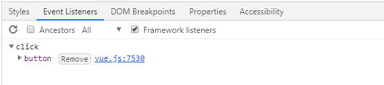
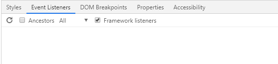

ここでは、`v-on`ディレクティブの`修飾子`のうち`イベント修飾子`の使い方をサンプルコードを参考に解説していきます。

## イベント修飾子とは
実際のアプリケーションではイベントハンドラ内で `event.preventDefault` や `event.stopPropagation` が必要になってくる思います。これらを自分で実装してもいいのですが、手間が増えてしまいます。そこでそれらをより簡単に実装するための修飾子が`イベント修飾子`です。

## イベント修飾子の種類
| 修飾子  | 内容  |
|---------|------|
|   stop  | イベントの伝搬停止  event.stopPropagation()を呼ぶ |
| prevent | デフォルトの処理停止  event.preventDefault()を呼ぶ  |
| capture | キャプチャフェーズで実行  [EventTarget.addEventListener()](https://developer.mozilla.org/ja/docs/Web/API/EventTarget/addEventListener)の設定を参照  |
|   self  | 要素がイベントの発生源の時のみ実行  |
|   once  | 一度のみ実行  [EventTarget.addEventListener()](https://developer.mozilla.org/ja/docs/Web/API/EventTarget/addEventListener)の設定を参照  |
| passive | ハンドラが「event.preventDefault()を呼び出さない」ことを伝える  [EventTarget.addEventListener()](https://developer.mozilla.org/ja/docs/Web/API/EventTarget/addEventListener)の設定を参照  |
|  native | コンポーネントのルートのイベントをハンドリング  詳しく別の記事で解説  |

一部の`修飾子`ではイベントの伝搬やキャプチャフェーズなどイベントの処理のされ方が重要になります。これについては別の記事で詳しく解説します。

## イベント修飾子の使い方
それぞれについて動くコードとその結果を見てみましょう。

### stop
`stop`はイベントの伝搬を停止します。

```html:title=Vue.js
<div id="app">
  <div id="parent" v-on:click="func('親')">
    <div id="child" v-on:click.stop="func('子')">
      <div id="grandchild" v-on:click="func('孫')">
      </div>
    </div>
  </div>
</div>
<script>
  var app = new Vue({
    el: "#app",
    methods:{
      func(target){
        console.log(target)
      }
    }
  })
</script>
<style>
  div{ padding: 2em; }
  #parent{ background: #ccc; }
  #child{ background: #999; }
  #grandchild{ background: #666; }
</style>
```

上記のコードの孫の要素をクリックすると以下のような結果になると思います。

```console:title=console
孫
子
```

上記では子の要素の`click`に`stop`を付けています。つけていない場合は`孫 => 子 => 親`といった順番で処理されますが、`stop`を付けた結果そこでイベントの伝搬が停止し、それ以降の処理が実行されなくなっています。

### prevent
`prevent`はこれを付けて指定した要素のデフォルトの処理停止します。

```html:title=Vue.js
<div id="app">
  <a href="https://fujiya228.com" v-on:click.prevent="func()">つくってみよう会</a>
</div>
<script>
  var app = new Vue({
    el: "#app",
    methods:{
      func(){
        console.log('a:click')
      }
    }
  })
</script>
```

上記のコードの孫の要素をクリックすると以下のような結果になると思います。

```console:title=console
a:click
```

上記では`a`の`click`に`prevent`を付けています。つけていない場合はリンク先に遷移しますが、`prevent`を付けた結果デフォルトの処理が停止し、指定した処理のみが実行されています。

### capture
`capture`は指定したハンドラをキャプチャフェーズで実行するようにします。キャプチャフェーズについては別の記事で詳しく解説します。

```html:title=Vue.js
<div id="app">
  <div id="parent" v-on:click="func('親')">
    <div id="child" v-on:click.capture="func('子')">
      <div id="grandchild" v-on:click="func('孫')">
      </div>
    </div>
  </div>
</div>
<script>
  var app = new Vue({
    el: "#app",
    methods:{
      func(target){
        console.log(target)
      }
    }
  })
</script>
<style>
  div{ padding: 2em; }
  #parent{ background: #ccc; }
  #child{ background: #999; }
  #grandchild{ background: #666; }
</style>
```

上記のコードの孫の要素をクリックすると以下のような結果になると思います。

```console:title=console
子
孫
親
```

上記では子の要素の`click`に`capture`を付けています。`capture`を付けたことで子に指定した処理がキャプチャフェーズで処理され、孫よりも先になっています。キャプチャフェーズについては別の記事で詳しく解説します。

### self
`self`はこれを付けて指定した要素がイベントの発生源の時のみハンドラが実行されます。

```html:title=Vue.js
<div id="app">
  <div id="parent" v-on:click.self="func('親')">
    <div id="child" v-on:click.self="func('子')">
      <div id="grandchild" v-on:click.self="func('孫')">
      </div>
    </div>
  </div>
</div>
<script>
  var app = new Vue({
    el: "#app",
    methods:{
      func(target){
        console.log(target)
      }
    }
  })
</script>
<style>
  div{ padding: 2em; }
  #parent{ background: #ccc; }
  #child{ background: #999; }
  #grandchild{ background: #666; }
</style>
```

上記のコードの場合、どの要素をクリックしてもその要素に指定した処理しか実行されません。

### once
`once`はこれを付けてイベントが一度のみ実行されます

```html:title=Vue.js
<div id="app">
  <button v-on:click.once="count++">count++</button>
  <p>Count: {{ count }}</p>
</div>
<script>
  var app = new Vue({
    el: "#app",
    data: {
      count: 0
    }
  })
</script>
```

ボタンをクリックすると直後に割り当てられたイベントリスナが削除され、その結果一度しか実行されなくなります。開発者ツールでもクリック後に削除されているのが確認できます。

**クリック前（削除前）**



**クリック後（削除後）**



### passive
`passive`はハンドラが「event.preventDefault()を呼び出さない」ことをイベントを処理しているところ伝えます。これに関しては動きをみて確認するサンプルを示すのが難しいので、使い方のみ示します。

```js:title=Vue.js
v-on:click.passive="func()"
```

`passive`を付けることでデフォルトの処理をすぐに実行できパフォーマンスの改善が期待できます。

### native
`native`をコンポーネントに対して指定することで、コンポーネントのルートのイベントをハンドリングすることができます。
詳しくはコンポーネントに関する別の記事で解説します。

## まとめ
今回は`イベント修飾子`の基本的な使い方について解説しました。
他の`修飾子`については別の記事で解説していきたいと思います。
